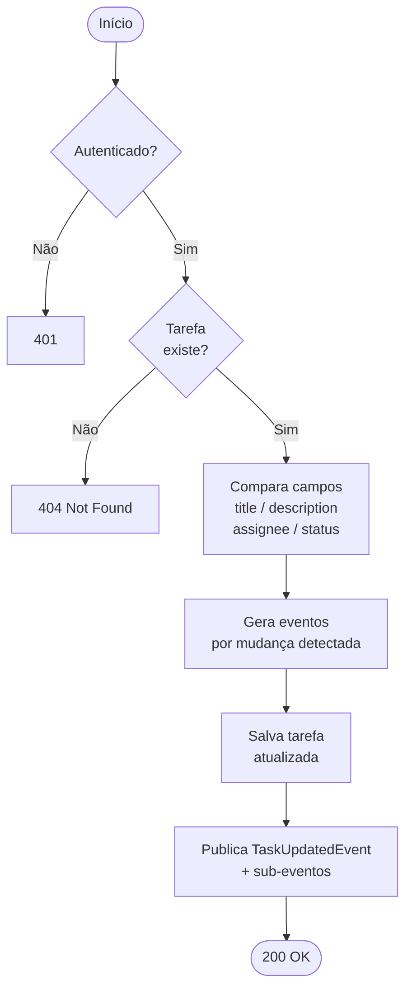
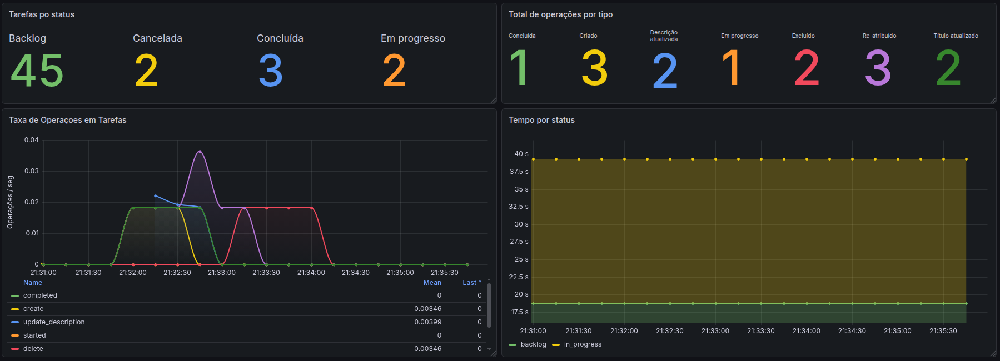

# Engenharia de Software - T2

Projeto de gerenciamento de tarefas desenvolvido como parte dos requisitos da disciplina de Engenharia de Software.

## Objetivos
O objetivo deste projeto é aplicar boas práticas modernas de engenharia de software e padrões de design na construção de um serviço robusto, focando no desacoplamento, testabilidade e na manutenção de um código limpo e padronizado.

## Arquitetura Hexagonal
O projeto foi estruturado seguindo os princípios da **Arquitetura Hexagonal (Ports and Adapters)**. 

A principal regra adotada é a inversão de dependência para isolar o núcleo da aplicação. A estrutura é focada na seguinte divisão de camadas:
* **Domain:** Contém as regras de negócio puras e modelos de domínio. Não possui dependências com frameworks ou detalhes de infraestrutura (com exceções)
* **Application:** Define os casos de uso e as interfaces (Portas) tanto de entrada (inbound) quanto de saída (outbound).
* **Adapter:** Contém as implementações das portas (Adaptadores). É aqui que residem os Controladores REST, acesso a banco de dados (MongoDB), etc.
* **Config:** Camada mais externa responsável por unir os adaptadores à aplicação por meio de injeção de dependência e configurações do Spring.

A integridade destas regras arquiteturais é testada e garantida continuamente na suíte de testes utilizando a biblioteca **ArchUnit**.

## Como executar

### Pré-requisitos
* Java 21 instalado.
* Docker instalado e em execução.

### Execução
Graças ao uso do módulo `spring-boot-docker-compose`, as dependências de infraestrutura contidas no arquivo `docker-compose.yml` (como o MongoDB) subirão automaticamente junto à aplicação. 

Para executar o sistema, rode o comando abaixo na raiz do projeto:

```bash
./gradlew bootRun
```

## Como contribuir e Padrões

Para garantir a qualidade e a consistência da base de código, seguimos regras rigorosas de padronização:

1. **Formatação de Código:** Utilizamos o **Spotless** configurado com o padrão *Palantir Java Format*. Se o seu código não estiver devidamente formatado, a build irá falhar. 
   Antes de commitar suas alterações, sempre execute:
   ```bash
   ./gradlew spotlessApply
   ```

2. **Testes:** Novas funcionalidades não devem ferir o isolamento das camadas estruturadas na Arquitetura Hexagonal. Sempre garanta que os testes de arquitetura implementados com **ArchUnit** passem com o comando:
   ```bash
   ./gradlew test
   ```

## Configurações

| Propriedade           | Descrição                                   | Valor padrão |
|-----------------------|---------------------------------------------|--------------|
| `app.metrics.enabled` | Habilita ou desabilita a coleta de métricas | `true`       |

## Modelagem de Dados

O banco de dados utilizado é o **MongoDB** (NoSQL). A escolha se justifica pela natureza heterogênea dos eventos de tarefa: cada tipo de evento (`TaskCreatedEvent`, `TaskStatusChangedEvent`, `TaskReassignedEvent`, etc.) carrega campos distintos, o que se encaixa bem no modelo de documentos sem schema rígido. Além disso, o MongoDB simplifica o armazenamento de subdocumentos aninhados, como os campos extras de cada evento.

### Coleções

**`users`** — Armazena os usuários do sistema.

| Campo       | Tipo        | Descrição                            |
|-------------|-------------|--------------------------------------|
| `_id`       | String      | Identificador único                  |
| `name`      | String      | Nome do usuário                      |
| `email`     | String      | E-mail (único)                       |
| `password`  | String      | Senha encriptada com BCrypt          |
| `enabled`   | Boolean     | Soft delete — `false` = removido     |
| `createdAt` | DateTime    | Data de criação                      |
| `updatedAt` | DateTime    | Data da última atualização           |

**`tasks`** — Armazena as tarefas colaborativas.

| Campo             | Tipo     | Descrição                                               |
|-------------------|----------|---------------------------------------------------------|
| `_id`             | String   | Identificador único                                     |
| `title`           | String   | Título da tarefa                                        |
| `description`     | String   | Descrição da tarefa                                     |
| `userId`          | String   | ID do usuário responsável                               |
| `status`          | String   | Status atual: `BACKLOG`, `IN_PROGRESS`, `COMPLETED`, `CANCELLED` |
| `statusUpdatedAt` | DateTime | Momento da última mudança de status                     |
| `deleted`         | Boolean  | Soft delete — `true` = removida                         |
| `createdAt`       | DateTime | Data de criação                                         |
| `updatedAt`       | DateTime | Data da última atualização                              |
| `version`         | Long     | Controle de versão otimista                             |

**`task_events`** — Histórico de eventos ocorridos nas tarefas. Cada documento representa uma ação (criação, atualização, deleção, mudança de status, etc.) com campos específicos por tipo.

| Campo       | Tipo     | Descrição                                                                                        |
|-------------|----------|--------------------------------------------------------------------------------------------------|
| `_id`       | String   | Identificador único                                                                              |
| `taskId`    | String   | Referência à tarefa                                                                              |
| `userId`    | String   | Quem realizou a ação                                                                             |
| `type`      | String   | Tipo do evento: `TASK_CREATED`, `TASK_DELETED`, `TASK_UPDATED`, `TASK_STATUS_CHANGED`, `TASK_REASSIGNED`, `TASK_TITLE_CHANGED`, `TASK_DESCRIPTION_CHANGED` |
| `createdAt` | DateTime | Momento do evento                                                                                |
| `...`       | —        | Campos adicionais conforme o tipo (ex: `oldStatus`, `newStatus`, `oldUserId`, `newUserId`, etc.) |

**`task_comments`** — Comentários associados a tarefas.

| Campo       | Tipo     | Descrição                        |
|-------------|----------|----------------------------------|
| `_id`       | String   | Identificador único              |
| `taskId`    | String   | Referência à tarefa              |
| `userId`    | String   | Usuário que comentou             |
| `content`   | String   | Conteúdo do comentário           |
| `enabled`   | Boolean  | Soft delete — `false` = removido |
| `createdAt` | DateTime | Data de criação                  |
| `updatedAt` | DateTime | Data da última atualização       |

**`discord_webhook_configs`** — Configurações de webhook Discord por usuário.

| Campo        | Tipo     | Descrição                          |
|--------------|----------|------------------------------------|
| `_id`        | String   | Identificador único                |
| `userId`     | String   | Referência ao usuário (1:1)        |
| `webhookUrl` | String   | URL do webhook no Discord          |
| `username`   | String   | Nome exibido nas mensagens         |
| `createdAt`  | DateTime | Data de criação                    |
| `updatedAt`  | DateTime | Data da última atualização         |

## Padrões de Projeto Utilizados

### Observer
Utilizado para desacoplar a publicação de eventos das ações que reagem a eles. Ao concluir uma operação (criar, atualizar ou deletar uma tarefa), o serviço publica um evento via `PublishEventPort`. Os handlers (`NotificationEventHandler` e `MicrometerMetricEventHandler`) escutam esses eventos de forma independente e reagem conforme sua responsabilidade — um dispara notificações no Discord, o outro coleta métricas.

Isso garante que o domínio não conhece nada sobre Discord ou Prometheus.

### Strategy
Utilizado no sistema de notificações Discord. A classe abstrata `AbstractDiscordNotification<E>` define o esqueleto do algoritmo de notificação, e cada subclasse (`TaskCreatedDiscordNotification`, `TaskDeletedDiscordNotification`, `TaskUpdatedDiscordNotification`) implementa os detalhes específicos: título, cor, destinatários e campos da mensagem. O `DiscordNotificationService` opera sobre a abstração, sem conhecer os tipos concretos.

### Ports and Adapters (Arquitetura Hexagonal)
O padrão central do projeto. Cada dependência externa (MongoDB, Discord, Spring Security, Micrometer) é acessada exclusivamente por meio de interfaces (portas), implementadas por adaptadores. O domínio nunca importa classes de infraestrutura diretamente.

## Fluxo de Requisições

Os fluxogramas abaixo descrevem os caminhos principais de cada operação. Todos os endpoints protegidos seguem o mesmo padrão inicial: validação do JWT → execução → resposta.

### Fluxograma: criação de usuário (`POST /users`)

```mermaid
flowchart TD
    A([Início]) --> B[POST /users]
    B --> C{Email já\ncadastrado?}
    C -- Sim --> D[400 Bad Request\nEmail já existe]
    C -- Não --> E[Encripta senha\nBCrypt]
    E --> F[Salva usuário\nMongoDB]
    F --> G([201 Created\n{ id }])
```

### Fluxograma: criação de tarefa (`POST /tasks`)

```mermaid
flowchart TD
    A([Início]) --> B{Usuário\nautenticado?}
    B -- Não --> C[401 Unauthorized]
    B -- Sim --> D{Tarefa válida?\ntítulo e descrição\nnão podem ser vazios}
    D -- Não --> E[400 Bad Request\nmotivo]
    D -- Sim --> F[Cria tarefa\nuserId do JWT\nstatus = BACKLOG]
    F --> G[Salva no MongoDB]
    G --> H[Publica TaskCreatedEvent]
    H --> I([201 Created\n{ id }])
```

### Fluxograma: atualização de tarefa (`PUT /tasks/{id}`)



### Fluxograma: notificação Discord (pós-evento)

```mermaid
flowchart LR
    A[Serviço publica\nTaskCreatedEvent] --> B[SpringEventPublisher]
    B --> C[Spring Message Bus]
    C --> D[NotificationEventHandler\n@EventListener]
    C --> E[MicrometerMetricEventHandler\n@EventListener]
    D --> F[TaskCreatedDiscordNotification\nStrategy]
    F --> G[DiscordNotificationService]
    G --> H[Busca webhookUrl\nno DiscordWebhookConfig]
    H --> I[HTTP POST\nDiscord API]
```

---

### Autenticação

Todos os endpoints, exceto `POST /users` e `POST /auth/login`, exigem o header:

```
Authorization: Bearer <token>
```

O token JWT é obtido no login e deve ser enviado em todas as requisições subsequentes.

**`POST /auth/login`**
```json
// Request
{ "email": "usuario@email.com", "password": "senha123" }

// Response 200
{ "token": "eyJhbGci..." }
```

**`POST /auth/logout`** — Invalida a sessão do usuário autenticado. Retorna `200 OK`.

---

### Usuários

**`POST /users`** — Cria um novo usuário. Não requer autenticação.
```json
// Request
{ "name": "Vítor", "email": "vitor@email.com", "password": "senha123" }

// Response 201
{ "id": "abc123" }
```
> Retorna `400` se o e-mail já estiver cadastrado.

**`GET /users/{id}`** — Retorna dados de um usuário específico.
```json
// Response 200
{ "id": "abc123", "name": "Vítor", "email": "vitor@email.com" }
```

**`GET /users`** — Retorna os dados do usuário autenticado (equivale a `/me`).

**`PUT /users/{id}`** — Atualiza nome e e-mail do usuário.
```json
// Request
{ "name": "Vitor D.", "email": "novo@email.com" }
```

**`DELETE /users/{id}`** — Remove o usuário (soft delete). Retorna `200 OK`.

---

### Tarefas

**`POST /tasks`** — Cria uma nova tarefa. A tarefa é criada com status `BACKLOG` e atribuída ao usuário autenticado.
```json
// Request
{ "title": "Implementar endpoint", "description": "Criar o GET /tasks/{id}" }

// Response 201
{ "id": "task123" }
```

**`GET /tasks/{id}`** — Retorna os detalhes de uma tarefa.
```json
// Response 200
{ "id": "task123", "title": "Implementar endpoint", "description": "...", "assigneeId": "abc123" }
```
> Retorna `404` se a tarefa não existir.

**`GET /tasks?assignedTo={userId}`** — Lista todas as tarefas atribuídas a um usuário.

**`PUT /tasks/{id}`** — Atualiza título, descrição, status e/ou responsável da tarefa. Apenas os campos enviados são processados. Cada alteração gera um evento específico no histórico.
```json
// Request
{ "title": "Novo título", "description": "Nova descrição", "assigneeId": "xyz456", "status": "IN_PROGRESS" }
```
> Valores aceitos para `status`: `BACKLOG`, `IN_PROGRESS`, `COMPLETED`, `CANCELLED`.

**`DELETE /tasks/{id}`** — Remove a tarefa (soft delete). Gera um evento `TASK_DELETED`. Retorna `200 OK`.

---

### Comentários em Tarefas

**`POST /tasks/{taskId}/comments`** — Adiciona um comentário à tarefa. O comentário é associado ao usuário autenticado.
```json
// Request
{ "content": "Precisa de revisão antes de fechar." }

// Response 201
{ "id": "c1", "taskId": "task123", "userId": "abc123", "content": "...", "createdAt": "2026-06-16T10:00:00" }
```

**`GET /tasks/{taskId}/comments`** — Lista todos os comentários de uma tarefa.
```json
// Response 200
[
  { "id": "c1", "taskId": "task123", "userId": "abc123", "content": "...", "createdAt": "..." }
]
```

**`DELETE /tasks/{taskId}/comments/{commentId}`** — Remove um comentário (soft delete). Apenas o autor pode remover. Retorna `200 OK`.

---

### Webhooks Discord

Cada usuário pode configurar um webhook Discord para receber notificações sobre suas tarefas. As notificações são disparadas automaticamente ao criar, atualizar ou deletar uma tarefa.

**`PUT /webhooks/discord`** — Cadastra ou atualiza o webhook do usuário autenticado.
```json
// Request
{ "webhookUrl": "https://discord.com/api/webhooks/..." }

// Response 200
{ "userId": "abc123", "webhookUrl": "https://...", "username": "Task Manager" }
```

**`GET /webhooks/discord`** — Retorna a configuração atual do webhook do usuário autenticado.

**`DELETE /webhooks/discord`** — Remove a configuração de webhook do usuário autenticado. Retorna `200 OK`.

#### Formato do payload enviado ao Discord

Quando um evento ocorre, a aplicação envia um HTTP POST no `webhookUrl` configurado com o seguinte corpo:

```json
{
  "username": "Task Manager",
  "embeds": [
    {
      "title": "Tarefa criada",
      "color": 3843421,
      "fields": [
        { "name": "Tarefa",      "value": "Título da tarefa",  "inline": true },
        { "name": "Responsável", "value": "Nome do usuário",   "inline": true },
        { "name": "Criado por",  "value": "Nome do autor",     "inline": true }
      ]
    }
  ]
}
```

O `username` é configurável via `app.notifications.discord.default-username`. A cor do embed varia por tipo de evento. Cada notificação só é enviada para usuários que tenham um `DiscordWebhookConfig` cadastrado. Os eventos podem ser desabilitados individualmente via `application.yml`:

```yaml
app:
  notifications:
    discord:
      enabled: true
      events:
        task-created:
          enabled: true
        task-deleted:
          enabled: true
        task-updated:
          enabled: true
```

## Arquitetura de Eventos

O sistema utiliza o mecanismo de eventos do Spring (`ApplicationEventPublisher`) para comunicação assíncrona interna entre camadas. O fluxo é:

```
Serviço de domínio
      │
      │  publica via PublishEventPort
      ▼
EventPublisherSpringAdapter  ──►  Spring Message Bus
                                        │
                              ┌─────────┴──────────┐
                              ▼                    ▼
               NotificationEventHandler   MicrometerMetricEventHandler
                              │
                    (por tipo de evento)
                              │
                    DiscordNotificationService
                              │
                    DiscordWebhookClient  ──►  Discord API
```

Os eventos publicados e seus tipos são:

| Evento                        | Gatilho                                 |
|-------------------------------|-----------------------------------------|
| `TaskCreatedEvent`            | Criação de uma tarefa                   |
| `TaskDeletedEvent`            | Deleção de uma tarefa                   |
| `TaskUpdatedEvent`            | Qualquer atualização (evento agregador) |
| `TaskReassignedEvent`         | Mudança de responsável                  |
| `TaskTitleChangedEvent`       | Mudança de título                       |
| `TaskDescriptionChangedEvent` | Mudança de descrição                    |
| `TaskStatusChangedEvent`      | Mudança de status                       |

O `NotificationEventHandler` escuta `TaskCreatedEvent`, `TaskDeletedEvent` e `TaskUpdatedEvent`, e delega ao `DiscordNotificationService`, que por sua vez usa o padrão **Strategy** para montar a mensagem correta conforme o tipo do evento.

O `MicrometerMetricEventHandler` escuta todos os eventos e atualiza os contadores e gauges do Prometheus. Ver seção **Métricas** para detalhes.

## Funcionalidades

### Métricas

O sistema inclui um dashboard de métricas que exibe informações relevantes sobre as tarefas, como o número total de tarefas,
tarefas concluídas, tarefas pendentes e outras estatísticas úteis para o gerenciamento eficiente das atividades, exportadas no formato do Prometheus.

Métricas são coletadas por eventos emitidos pela aplicação. Ou seja, coletar métricas e expô-las no formato do Prometheus
não quebra o isolamento da aplicação, já que a coleta é feita em adaptadores de saída. A classe responsável é `MicrometerMetricEventHandler`.

É possível ativar/desativar a coleta de métricas através da propriedade `app.metrics.enabled` no arquivo `application.yml`. Por padrão, a coleta de métricas está habilitada.
Desabilitar a coleta de métricas faz com que o bean da classe nem seja instanciado, portanto, os eventos não serão escutados por ela. A aplicação não sofre nenhuma alteração.

| Evento                        | Tipo    | Métrica                            | Tags                                                                                                                                                                                                                                                                                                    | Descrição                                                    |
|-------------------------------|---------|------------------------------------|---------------------------------------------------------------------------------------------------------------------------------------------------------------------------------------------------------------------------------------------------------------------------------------------------------|--------------------------------------------------------------|
| `TaskCreatedEvent`            | counter | `api_task_operations_total`        | `operation=create`, `description=Criado`                                                                                                                                                                                                                                                                | Incrementa o contador de tarefas criadas.                    |
| `TaskDeletedEvent`            | counter | `api_task_operations_total`        | `operation=delete`, `description=Excluído`                                                                                                                                                                                                                                                              | Incrementa o contador de tarefas excluídas.                  |
| `TaskReassignedEvent`         | counter | `api_task_operations_total`        | `operation=reassign`, `description=Re-atribuído`                                                                                                                                                                                                                                                        | Incrementa o contador de tarefas reatribuídas.               |
| `TaskTitleChangedEvent`       | counter | `api_task_operations_total`        | `operation=update_title`, `description=Título atualizado`                                                                                                                                                                                                                                               | Incrementa o contador de tarefas com título alterado.        |
| `TaskDescriptionChangedEvent` | counter | `api_task_operations_total`        | `operation=update_description`, `description=Descrição atualizada`                                                                                                                                                                                                                                      | Incrementa o contador de tarefas com descrição alterada.     |
| `TaskStatusChangedEvent`      | counter | `api_task_operations_total`        | Se o status é BACKLOG, `operation=deferred` e `description=Backlog`<br/>Se o status é IN_PROCESS, `operation=stated` e `description=Em progresso`<br/>Se status é COMPLETED, `operation=comlpeted` e `description=Concluída`<br/>Se status é CANCELLED, `operation=cancelled` e `description=Cancelada` | Incrementa o contador de tarefas com status alterado.        |
| `TaskStatusChangedEvent`      | timer   | `api_task_status_duration_seconds` | `status=backlog/in_process/completed/cancelled` e `description=Backlog/Em progresso/Concluída/Cancelada`                                                                                                                                                                                                | Registra a duração que as tarefas permanecem em cada status. |
| -                             | gauge   | `api_tasks_by_status`              | `status=backlog/in_process/completed/cancelled` e `description=Backlog/Em progresso/Concluída/Cancelada`                                                                                                                                                                                                | Mede a quantidade de tarefas em cada status.                 |

Ao subir a aplicação, devido ao `spring-docker-compose` e o arquivo `docker-compose`, o Prometheus e Grafana são iniciados automaticamente nas portas `9090` e `3000`, respectivamente. Ao acessar o Grafana, use o usuário `admin` e senha `admin` para fazer login.
No diretório `dashboards` estão os arquivos de dashboard usados, basta baixar o arquivo e importá-lo no Grafana para visualizar as métricas coletadas. Exemplo:



## Testes Automatizados

Os testes cobrem a camada de serviços (domínio), que é onde reside a lógica de negócio. A estratégia adotada é o teste unitário com mocks via **Mockito**, complementado por testes de arquitetura com **ArchUnit**.

A cobertura atual da camada `service` é de **69%** (16/23 classes), atendendo ao requisito mínimo de 60%.

### Testes de Unidade
Cada serviço é testado isoladamente, com todas as dependências mockadas. Os objetos de domínio são gerados com **EasyRandom** para evitar a construção manual de fixtures. Cenários cobertos incluem fluxo feliz e casos de erro (usuário não autenticado, entidade não encontrada, etc.).

Classes testadas:
* `LoginImpl` — autenticação com e-mail/senha inválidos
* `DeleteTaskImpl` — deleção com tarefa inexistente e usuário não autenticado
* `GetTasksByUserImpl` — listagem de tarefas por usuário
* `TaskCreatedDiscordNotification`, `TaskDeletedDiscordNotification`, `TaskUpdatedDiscordNotification` — montagem e envio de notificações Discord
* `DiscordNotificationService` — orquestração de notificações
* `CreateTaskCommentImpl`, `DeleteTaskCommentImpl`, `GetTaskCommentsImpl` — CRUD de comentários

### Testes de Arquitetura
A classe `ArchitectureTest` utiliza **ArchUnit** para verificar em tempo de execução que as regras da Arquitetura Hexagonal são respeitadas: adaptadores não acessam diretamente outros adaptadores, o domínio não importa classes de infraestrutura, etc.

Para rodar todos os testes:
```bash
./gradlew test
```
